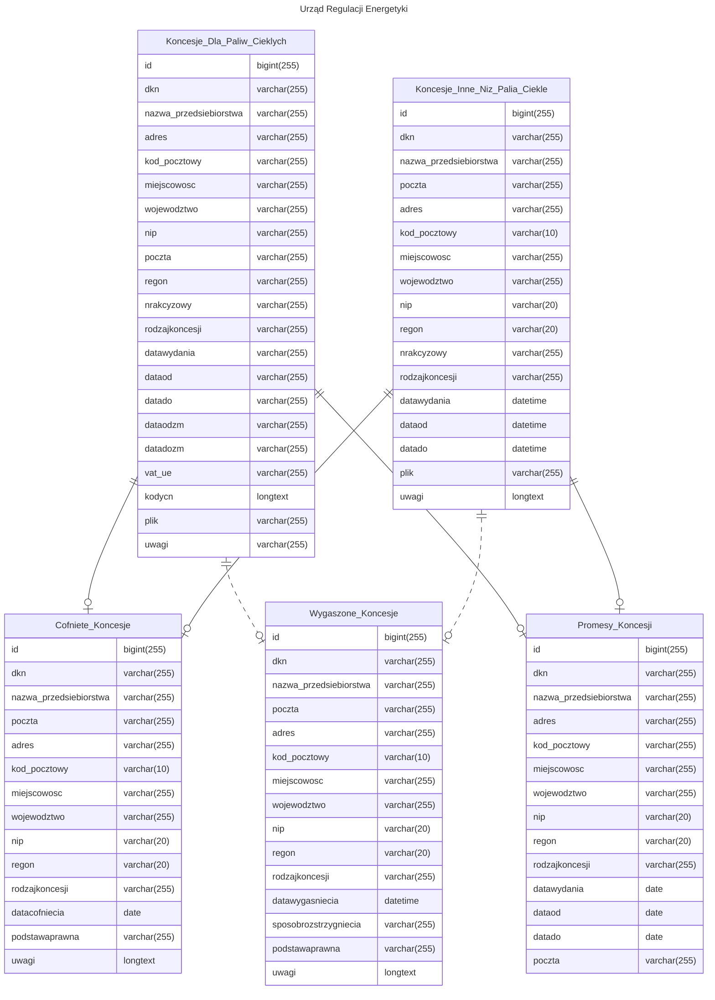

# ure-database-project

database based on <https://rejestry.ure.gov.pl/>

## Entity Relationship Diagram

```mermaid
---
title: Urząd Regulacji Energetyki
---
erDiagram

    Cofniete_Koncesje  {
      id  bigint(255)   
      dkn  varchar(255)   
      nazwa_przedsiebiorstwa  varchar(255)   
      poczta  varchar(255)   
      adres  varchar(255)   
      kod_pocztowy  varchar(10)   
      miejscowosc  varchar(255)   
      wojewodztwo  varchar(255)   
      nip  varchar(20)   
      regon  varchar(20)   
      rodzajkoncesji  varchar(255)   
      datacofniecia  date   
      podstawaprawna  varchar(255)   
      uwagi  longtext  
    }
    Koncesje_Dla_Paliw_Cieklych  {
      id bigint(255)   
      dkn varchar(255)   
      nazwa_przedsiebiorstwa varchar(255)   
      adres varchar(255)   
      kod_pocztowy varchar(255)   
      miejscowosc varchar(255)   
      wojewodztwo varchar(255)   
      nip varchar(255)   
      poczta varchar(255)   
      regon varchar(255)   
      nrakcyzowy varchar(255)   
      rodzajkoncesji varchar(255)   
      datawydania varchar(255)   
      dataod varchar(255)   
      datado varchar(255)   
      dataodzm varchar(255)   
      datadozm varchar(255)   
      vat_ue varchar(255)   
      kodycn longtext   
      plik varchar(255)   
      uwagi varchar(255)  
    }
    Promesy_Koncesji  {
      id bigint(255)   
      dkn varchar(255)   
      nazwa_przedsiebiorstwa varchar(255)   
      adres varchar(255)   
      kod_pocztowy varchar(255)   
      miejscowosc varchar(255)   
      wojewodztwo varchar(255)   
      nip varchar(20)   
      regon varchar(20)   
      rodzajkoncesji varchar(255)   
      datawydania date   
      dataod date   
      datado date   
      poczta varchar(255)  
    }
    Koncesje_Inne_Niz_Palia_Ciekle  {
      id bigint(255)   
      dkn varchar(255)   
      nazwa_przedsiebiorstwa varchar(255)   
      poczta varchar(255)   
      adres varchar(255)   
      kod_pocztowy varchar(10)   
      miejscowosc varchar(255)   
      wojewodztwo varchar(255)   
      nip varchar(20)   
      regon varchar(20)   
      nrakcyzowy varchar(255)   
      rodzajkoncesji varchar(255)   
      datawydania datetime   
      dataod datetime   
      datado datetime   
      plik varchar(255)   
      uwagi longtext  
    }
    Wygaszone_Koncesje  {
      id bigint(255)   
      dkn varchar(255)   
      nazwa_przedsiebiorstwa varchar(255)   
      poczta varchar(255)   
      adres varchar(255)   
      kod_pocztowy varchar(10)   
      miejscowosc varchar(255)   
      wojewodztwo varchar(255)   
      nip varchar(20)   
      regon varchar(20)   
      rodzajkoncesji varchar(255)   
      datawygasniecia datetime   
      sposobrozstrzygniecia varchar(255)   
      podstawaprawna varchar(255)   
      uwagi longtext  
    }
    Koncesje_Dla_Paliw_Cieklych ||--o| Cofniete_Koncesje : ""
    Koncesje_Inne_Niz_Palia_Ciekle ||--o| Cofniete_Koncesje : ""
    Koncesje_Dla_Paliw_Cieklych ||..o|  Wygaszone_Koncesje : ""
    Koncesje_Inne_Niz_Palia_Ciekle ||..o|  Wygaszone_Koncesje : ""
    Koncesje_Dla_Paliw_Cieklych ||--o| Promesy_Koncesji : ""
    Koncesje_Inne_Niz_Palia_Ciekle ||--o| Promesy_Koncesji : ""
```
